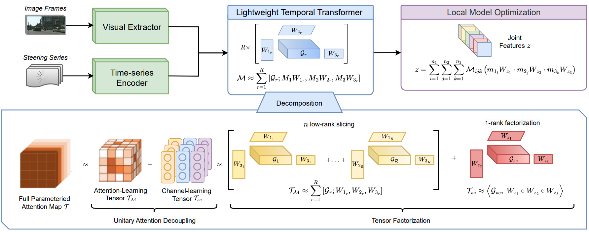

# Lightweight Temporal Transformer Decomposition for Federated Autonomous Driving

*Traditional vision-based autonomous driving systems often face difficulties in navigating complex environments when relying solely on single-image inputs. To overcome this limitation, incorporating temporal data such as past image frames or steering sequences, has proven effective in enhancing robustness and adaptability in challenging scenarios. While previous high-performance methods exist, they often rely on resource-intensive fusion networks, making them impractical for training and unsuitable for federated learning. To address these challenges, we propose lightweight temporal transformer decomposition, a method that processes sequential image frames and temporal steering data by breaking down large attention maps into smaller matrices. This approach reduces model complexity, enabling efficient weight updates for convergence and real-time predictions while leveraging temporal information to enhance autonomous driving performance. Intensive experiments on three datasets demonstrate that our method outperforms recent approaches by a clear margin while achieving real-time performance. Additionally, real robot experiments further confirm the effectiveness of our method.*


*<center>**Figure 1**: An overview of our lightweight temporal transformer decomposition method for federated autonomous driving.</center>*

This repository is the implementation of **Lightweight Temporal Transformer Decomposition for Federated Autonomous Driving**. We benchmark our method on three public datasets: Udacity+, Carla, and Gazebo.

For the detail, please refer to [link](https://arxiv.org/abs/2506.23523).

This repository is based on and inspired by @Binh X. Nguyen's [work](https://github.com/aioz-ai/CDL). We sincerely thank them for their sharing of the codes.

## Summary

* [Prerequisites](#prerequisites)
* [Datasets](#datasets)
* [Networks](#networks)
* [Training](#training)
* [Pretrained models and Testing](#pretrained-models-and-testing)
* [Citation](#citation)
* [License](#license)
* [More information](#more-information)

### Prerequisites

PYTHON 3.8

CUDA 11.1

Please install dependency packages by running the following command:
```
pip install -r requirements.txt
```

### Datasets

* For the UDACITY+ dataset, we provide:
    * The split train/test dataset for the GAIA network at [link](https://huggingface.co/datasets/aiozai/AIOZ-LTFed_IROS2025/resolve/main/LTFed_IROS2025_udacity_gaia.zip). You can download and extract them into the "data/driving_udacity/" folder.

* For the GAZEBO dataset, we provide:
    * The original dataset and the split train/test dataset for the GAIA network at [link](https://huggingface.co/datasets/aiozai/AIOZ-LTFed_IROS2025/resolve/main/LTFed_IROS2025_gazebo_gaia.zip). You can download and extract them into the "data/driving_gazebo/" folder.

* For the CARLA dataset, we provide:
    * The original dataset and the split train/test dataset for the GAIA network at [link](https://huggingface.co/datasets/aiozai/AIOZ-LTFed_IROS2025/resolve/main/LTFed_IROS2025_carla_gaia.zip). You can download and extract them into the "data/driving_carla/" folder.

### Networks

Important: Before running any command lines in this section, please run the following command to access the 'graph_utils' folder:
```
cd graph_utils
```
And now, you are in the 'graph_utils' folder.

Please download graph data at [link](https://github.com/omarfoq/communication-in-cross-silo-fl/tree/main/graph_utils/data) and put into the `data` folder.

* To generate networks for the UDACITY+ dataset and compute the cycle time for them:
    ```
    bash generate_network_driving-udacity.sh
    ```

* To generate networks for the GAZEBO dataset and compute the cycle time for them:
    ```
    bash generate_network_driving-gazebo.sh
    ```

* To generate networks for the CARLA dataset and compute the cycle time for them:
    ```
    bash generate_network_driving-carla.sh
    ```

### Training

* To train our method on the UDACITY+ dataset with the GAIA network, run:

```
bash train.sh
```

* To train our method on the CARLA/GAZEBO dataset with this network, you can use the same setup on UDACITY+.

### Pretrained models and Testing

We provide the pretrained models, which are trained on UDACITY+, GAZEBO, and CARLA datasets with the GAIA network by our method at the last epoch. Please download at [link](https://huggingface.co/aiozai/AIOZ-LTFed_IROS2025_pretrained-models/resolve/main/pretrained_models.zip) and extracted them into the "pretrained_models/" folder.

The models can be evaluated on both train and test sets in each dataset via:
```
bash test.sh
```

### Citation

If you use this code as part of any published research, we'd really appreciate it if you could cite the following paper:

```
coming soon!
```

### License

MIT License

### More information
AIOZ AI Homepage: https://ai.aioz.io
